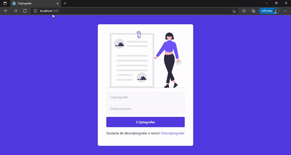
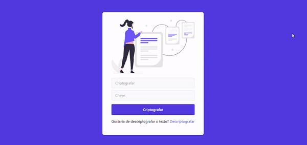

<h3 align="center">
    
</h3>
 
 <h3 align="center">
    
</h3>
 
<p align="center"> 
   
  
  <a href="https://github.com/savio-2-lopes">
    
  </a>
 
 <a href="https://github.com/savio-2-lopes">
    
  </a>
</p>

<br>

## :pushpin: Índice

- [Sobre](#sobre-o-projeto)
- [Como executar](#executar)
- [Tecnologias](#tecnologia)
- [Créditos de imagem](#creditos)

<br>

<a id="sobre-o-projeto"></a>

## 💻 Sobre o projeto

:zap: Simples website em Flask e Tailwind para criptografar/descriptografar textos utilizando os métodos de criptografia abaixo:

<br>

### :book: Cifra Cesar

<h3 align="center">
    
</h3>
 
<br>

### :memo: Cifra permuta

<h3 align="center">
    
</h3>

<br>

<a id="executar"></a>

## 🚀 Como executar o projeto

### Pré-requisitos

Antes de começar, você vai precisar ter instalado em sua máquina as seguintes ferramentas:
[Git](https://git-scm.com), [Python](https://www.python.org/).
Além disto é bom ter um editor para trabalhar com o código, como [VSCode](https://code.visualstudio.com/)

<br>

#### 🧭 Rodando a aplicação

```bash

# Clone o repositório
$ git clone https://github.com/savio-2-lopes/simple_sites_flask_encryption_ciphers.git

# Acesse a pasta 
$ cd simple_sites_flask_encryption_ciphers

# Caso não esteja em ambiente virtual, certifique-se de criá-lo dentro da pasta (em Linux/macOS) e ativá-lo
$ python3 -m venv venv
$ . venv/bin/activate

# Para criar o ambiente virtual em Windows e ativá-lo, utilize o comando abaixo
$ py -3 -m venv venv
$ venv\Scripts\activate

# Na pasta, instale as depedências
$ pip install -r requirements.txt

# Após isso inicie os arquivos dentro de sua respectiva pastas
$ python3 app.py

# Se não ocorrer erro, acesse o navegador e digite:
$ http://localhost:5000/


```

<br>

<a id="tecnologia"></a>

## 🛠 Tecnologias

As seguintes ferramentas foram usadas na construção do projeto:

- [Flask](https://flask.palletsprojects.com/en/2.0.x/)
- [Tailwind](https://tailwindcss.com/)

<br>

<a id="creditos"></a>

## 💜 Créditos de Imagem

Todos os direitos de imagens utilizadas no projeto são do site [undraw.co](https://undraw.co/illustrations).